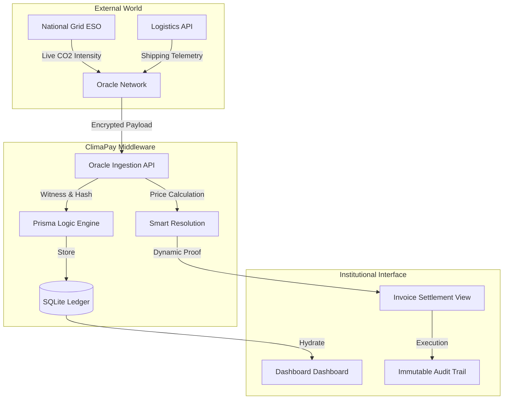

# ClimaPay: ESG Settlement Middleware
### **Settlement Precision for an Institutional World.**

ClimaPay is a next-generation "Settlement Middleware" designed to bridge the gap between real-world environmental data and financial transactions. It enforces ESG-linked contracts through real-time cryptographic verification and automated price adjustments.

---

## System Architecture

ClimaPay operates as a trustless orchestration layer between environmental oracles and financial ledgers.



---

##  Key Features

- **Dynamic ESG Adjustments**: Contract values shift in real-time based on verified carbon intensity.
- **Cryptographic Witnessing**: Every transaction is hashed (SHA-256) at the point of verification, creating a permanent audit trail.
- **Industrial Design System**: Built on a high-contrast, "Mixed Clinical" design system featuring IBM Plex Mono for analytical clarity.
- **Oracle Independence**: Pluggable architecture for diverse environmental data sources (Grid, Satellite, IoT).

---

##  Technology Stack

- **Framework**: [Next.js 15 (App Router)](https://nextjs.org/)
- **Database**: [SQLite](https://www.sqlite.org/) via [Prisma ORM](https://www.prisma.io/)
- **Styling**: Vanilla CSS + Tailwind CSS (Industrial Precision System)
- **Typography**: IBM Plex Mono (Google Fonts)
- **Icons**: Material Symbols Rounded

---

##  Getting Started

### Prerequisites
- Node.js 18.x or higher
- npm or yarn

### Installation
1.  **Clone the Repository**:
    ```bash
    git clone [repository-url]
    cd climapay
    ```
2.  **Install Dependencies**:
    ```bash
    npm install
    ```
3.  **Initialize Database**:
    ```bash
    npx prisma db push
    npx prisma db seed
    ```
4.  **Run Development Server**:
    ```bash
    npm run dev
    ```

Access the platform at `http://localhost:3000`.

---

##  Demonstration Guide

Ready to showcase ClimaPay? 
Refer to our [Demo Guide](./demo_guide.md) for a step-by-step presentation script that covers the end-to-end "Contract → Ingestion → Settlement" flow.

---

## Ledger Integrity

ClimaPay ensures that no financial settlement occurs without a verified environmental proof. The `Settlement` record in our ledger links every Eurocent to a specific `NodeLog` entry, witnessed by a cryptographic signature.

---

*Built for the 2024 Industrial ESG Hackathon.*
